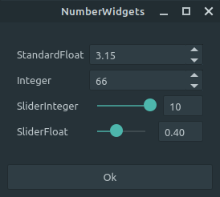
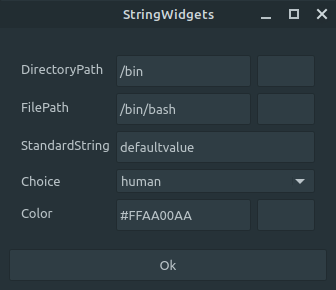
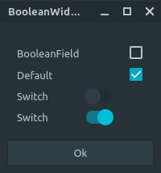
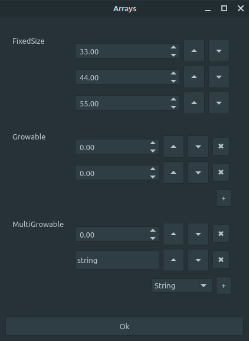

# QJForm

Official Repository is at: https://gitlab.com/GavinNL/QJForm

Create simple UI Forms using a JSON Schema.  This application functions similar
to zenity, but allows you to build your UI using a JSON schema.


# Downloads

The following downloads are provided. You may need to `chmod +x` the file before
you can run it.

| Branch | Status | Download |
| ------ | ------ | -------- |
| dev    | [](https://gitlab.com/GavinNL/QJForm/-/commits/dev)       | [ Ubuntu 18.04](https://gitlab.com/GavinNL/QJForm/-/jobs/artifacts/dev/raw/artifacts/QJForm?job=build-bionic) <br> [ Ubuntu 20.04](https://gitlab.com/GavinNL/QJForm/-/jobs/artifacts/dev/raw/artifacts/QJForm?job=build-focal)         |
| master | [](https://gitlab.com/GavinNL/QJForm/-/commits/master)       | [ Ubuntu 18.04](https://gitlab.com/GavinNL/QJForm/-/jobs/artifacts/master/raw/artifacts/QJForm?job=build-bionic) <br> [ Ubuntu 20.04](https://gitlab.com/GavinNL/QJForm/-/jobs/artifacts/master/raw/artifacts/QJForm?job=build-focal)         |


## Purpose

I needed a way to quickly interact with a project but didn't want to build a
specific UI for it. Rather I wanted to be able to send JSON messages to my
application using standard input. So I developed this application based on https://rjsf-team.github.io/react-jsonschema-form/.

Simply build the UI using a JSON schema and then pipe that data to QJForm. It
will produce a UI which you can use to set the values.


```Bash
cat samples/numbers.json | QJForm
```


Pressing OK will print out the JSON data to standard output.
```
{
    "float_range": 0.4,
    "integer_range": 0,
    "standard_float": 3.145,
    "standard_integer": 66
}

```

Use the  `-b` flag to print the values as bash variables

```
float_range=0.4
integer_range=0
standard_float=3.145
standard_integer=66
```

```bash
$ eval $( cat samples/numbers.json | QJForm -b)
$ echo $float_range
0.283379
```


# License

The following license applies to QJForm only. You must also comply with the
[Qt License](https://doc.qt.io/qt-5/licensing.html)


```
Copyright 2020 GavinNL

Permission is hereby granted, free of charge, to any person obtaining a copy of
this software and associated documentation files (the "Software"), to deal in
the Software without restriction, including without limitation the rights to
use, copy, modify, merge, publish, distribute, sublicense, and/or sell copies of
the Software, and to permit persons to whom the Software is furnished to do so,
subject to the following conditions:

The above copyright notice and this permission notice shall be included in all
copies or substantial portions of the Software.

THE SOFTWARE IS PROVIDED "AS IS", WITHOUT WARRANTY OF ANY KIND, EXPRESS OR
IMPLIED, INCLUDING BUT NOT LIMITED TO THE WARRANTIES OF MERCHANTABILITY, FITNESS
FOR A PARTICULAR PURPOSE AND NONINFRINGEMENT. IN NO EVENT SHALL THE AUTHORS OR
COPYRIGHT HOLDERS BE LIABLE FOR ANY CLAIM, DAMAGES OR OTHER LIABILITY, WHETHER
IN AN ACTION OF CONTRACT, TORT OR OTHERWISE, ARISING FROM, OUT OF OR IN
CONNECTION WITH THE SOFTWARE OR THE USE OR OTHER DEALINGS IN THE SOFTWARE.
```

# Building

## Dependencies

 * Qt 5+

Then to compile the application. First install the Qt dev package for your distro.

```Bash
sudo apt install qtbase5-dev
```

```Bash
cd QJForm
mkdir build && cd build
cmake .. -DCMAKE_BUILD_TYPE=Release
make
```

## Using As a Library

Additionally you can use QJForms as a library for your own projects.
Simply add this repo as a submodule and then link to the CMake target : `QJForm::QJForm`

```cpp

// set the schema to use
QJsonObject schemaJsonObject = ...

auto * F = new QJform::QJForm();
F->setSchema( schemaJsonObject );

// Add F as a widget to a window

```

### Signals

THe QJForm class exposes a single signal `changed()` which you can use to
check when the user has changed a value in the form. It unforunately does not
provide you with which widget was changed, just that an item was changed. You will
need to use the `get()` method to retrieve the `QJsonObject`


# Create A Simple Form

There are a few samples in the `samples` folder which explain how to build various
widgets

```Bash
cat samples/numbers.json | QJForm
```


# JSON Types

## Strings

```Bash
cat samples/strings.json | QJForm
```


### String Properties

| Property      | Type             | Description                                    |
| ------------- | ---------------- | ---------------------------------------------- |
| `"type"`      | string           | Must be set to `"string"`                      |
| `"enum"`      | array of strings | If set, will turn the widget into a combo box. |
| `"ui:widget"` | string           | One of `"color"`, `"dir"`, `"file"`, `"date"`  |


## Numbers

```Bash
cat samples/numbers.json | QJForm
```


### Number Properties

| Property      | Type   | Description                             |
| ------------- | ------ | --------------------------------------- |
| `'"type"`'    | string | One of '"integer"' or `"number"`        |
| `"ui:widget"` | string | One of `"range"` or `"updown"`(default) |
| `"minimum"`   | number | minimum value for the numbers           |
| `"maximum"`   | number | maximum value for the numbers           |

```
{
    "type" : "number",
    "ui:widget" : "range",
    "minimum" : 0,
    "maximun: " 100
}
```

## Boolean

```Bash
cat samples/boolean.json | QJForm
```



### Boolean Properties

| Property    | Type    | Description                    |
| ----------- | ------- | ------------------------------ |
| `'"type"`'  | string  | Must be '"boolean"'            |
| `"default"` | boolean | The initial value of the field |
| `"ui:widget"` | string | One of "checkbox" or "switch" |

```
{
    "type" : "boolean",
    "title" : "Boolean Field",
    "default" : true
}
```


## Arrays

```Bash
cat samples/arrays.json | QJForm
```



### Array Properties

| Property            | Type             | Description                                                                                         |
| ------------------- | ---------------- | --------------------------------------------------------------------------------------------------- |
| `"items"`           | array of objects | A list of JSON Shema objects                                                                        |
| `"additionalItems"` | array of objects | A list of JSON Shema objects. These items can be chosen from by the user when adding/removing items |

 **Notes**:
 * If `"additionalItems"` is not set. Then the array size is fixed.
 * If `"additionalItems"` is an array of a single object, then the ComboBox of items is not shown

## Objects

| Property      | Type    | Description                                                                            |
| ------------- | ------- | -------------------------------------------------------------------------------------- |
| `"ui:visble"` | boolean | Shows/Hides the property in the UI. The property will be visible in the final document |
| `"ui:width"`  | number  | Width of the root window                                                               |
| `"ui:height"` | number  | height of the root window                                                              |
| `"title"`     | string  | Alternative text for the key, or window title if root                                  |
